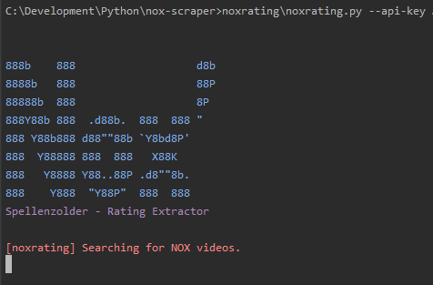

<p align="center">
 <br />
<span>Extract boardgames scoring from Nox Youtube Videos.</span>
</p>

<p align="center">
  <a href="#installation">Installation</a>
  &nbsp;&nbsp;&nbsp;|&nbsp;&nbsp;&nbsp;
  <a href="#usage">Usage</a>
</p>

## About

<a href="https://www.youtube.com/channel/UCtzMObnv92ni0T_8CHGtDag" target="_BLANK">Nox' Spellenzolder</a> is a Dutch Youtuber giving reviews of boardgames and scoring them. Until now there was no way of getting a list of all scores and ranking. On special occations Nox' does a Top-50, but that's it.

This Python application gathers information about the boardgame and Nox' scores and saves the output as .csv. With the following header:

```code
title;link;id;stars;score;date
```


## Dataset
The scoring of Nox' boardgames are available on the Dataset repository: https://github.com/JPAntonisse/nox-spellenzolder


## Installation

```console
# clone the repo
$ git clone https://github.com/JPAntonisse/nox-spellenzolder-rating.git

# change the working directory to noxrating
$ cd noxrating

# install the requirements
$ pip install -r requirements.txt
```


## Usage

```console
$ python noxrating\noxrating.py --api-key {YOUTUBE_API_KEY}
```

Go <a href="https://developers.google.com/youtube/v3/getting-started" target="_blank">here</a> to get a Youtube API key
